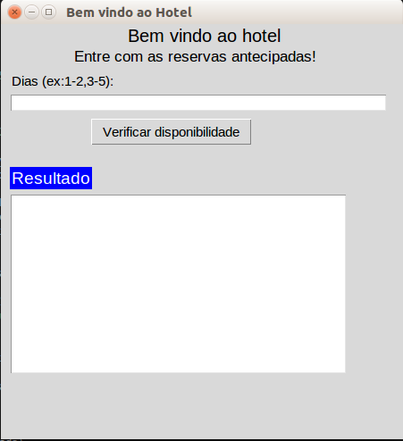
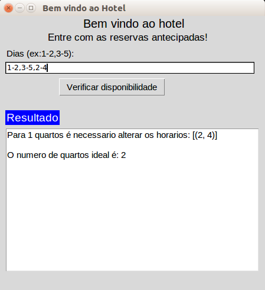
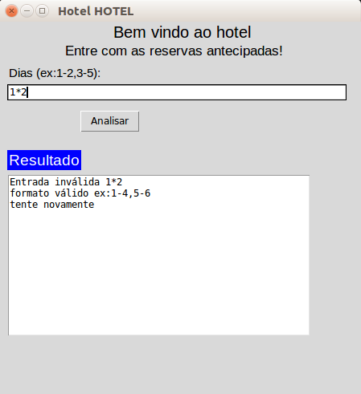

Temas:
 - Greed

# Hotel

**Conteúdo da Disciplina**: Greed 

## Alunos
|Matrícula | Aluno |
| -- | -- |
| 17/0080366  |  Moacir Mascarenha |
| 15/0062567  |  Marcos Adriano Nery |

## Sobre

O algorítimo (interval scheduling), ganancioso, é capaz de obter o número de quartos necessários a partir de um conjunto de entradas. As entradas consistem em dias de inicio e fim de uma reserva em um hotel.

## Screenshots

## Instalação 
**Linguagem**: python 

#### Requisitos

- python3 instalado
- Biblioteca tkinter instalada
    
        pip install tkinter

## Uso 
[Video](./img/video.mp4)

Entre com os dias em que se deseja agendar os quartos do hotel.

Exemplo:
 
    1-2,3-4,5-6

clique em verificar

## Referências
> Find if k bookings possible with given entrada and saida times. Disponível em: https://www.geeksforgeeks.org/find-k-bookings-possible-given-entrada-saida-times/

> Text Widgets .Disponível em: https://www.python-course.eu/tkinter_text_widget.php

> Python GUI Examples (Tkinter Tutorial). Disponível em: https://likegeeks.com/python-gui-examples-tkinter-tutorial/

